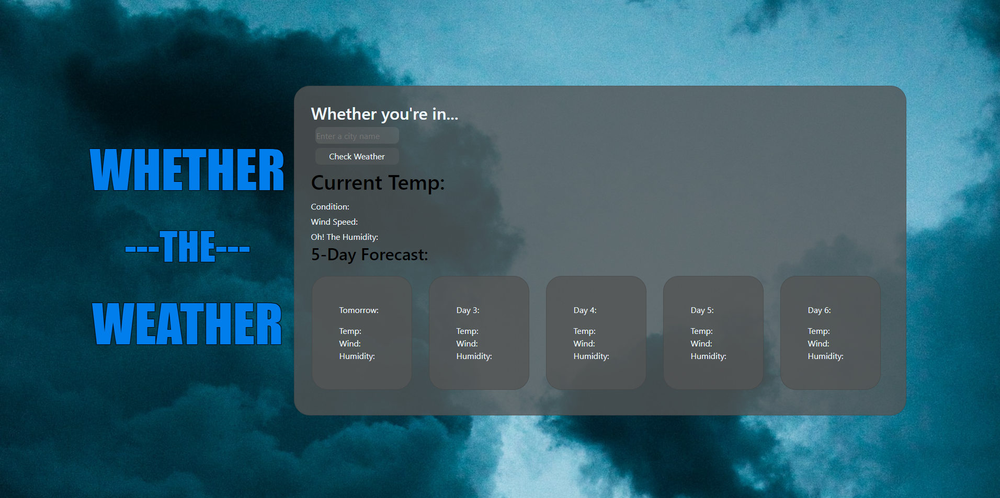

# whether_the_weather

## Description
My Task: I was challenged this week to create a functional weather app wherein I would call on an API to get the current weather in any given city, as well as provide the weather forecast for the next 5 days in said given city.

- I was motivated to accomplish this task by my peers, they assured me that these are skills I do possess, and by creating this application, I proved both them, and myself, right.
- I built this project to better my skills using mechanics I was not intimitely familiar with, such as using 3rd party APIs, as well as performing more complex JavaScript to replace various aspects of my HTML.
- This project solved many problems, the leading one being giving me confidence in my skills and knowledge I didn't have before accomplishing this goal.
- I learned so much in this project! I learned how to modify classes in HTML with JS, I learned and/or functions, I learned how to implement APIs as well as various aspects of Bootstrap to aid with my design in my CSS, I learned how to stringify arrays with JSON and how to pull specific information from them. All of these are very important and vital skills to know when working with JS.

## Table of Contents:
Installation
UserStory
Usage
Screenshot
Credits
License
Closing

## Installation
-This is an active web page. No installation is required outside visiting my GitHub Repository at https://github.com/RayR124?tab=repositories.

## UserStory
- Below is the user story and acceptance criteria I was given.

- AS A traveler
I WANT to see the weather outlook for multiple cities
SO THAT I can plan a trip accordingly

- Acceptance Criteria

GIVEN a weather dashboard with form inputs
WHEN I search for a city
THEN I am presented with current and future conditions for that city and that city is added to the search history
WHEN I view current weather conditions for that city
THEN I am presented with the city name, the date, an icon representation of weather conditions, the temperature, the humidity, and the wind speed
WHEN I view future weather conditions for that city
THEN I am presented with a 5-day forecast that displays the date, an icon representation of weather conditions, the temperature, the wind speed, and the humidity
WHEN I click on a city in the search history
THEN I am again presented with current and future conditions for that city

- Acceptance Criteria Simplified This project is about creating a Weather Application. You will need to do the following:

In this project you'll create a webpage that allows people to perform searches for the weather report in various cities.
You will need to complete the following subtasks:

Create a page with the following:

A text input for entering a city
A button to perform the search
A section for showing previous searches
A section for showing the fetched weather data
The input and button should be inside a form so that pressing "enter" on the input field will cause the search to trigger

## Usage:
When the user enters a city and performs the search (the form is submitted):

Fetch the weather data from the openWeatherMap API (the 5 day forcast)

A 5 day forecast can contain today as one of the days. This should be perfectly fine as long as you're showing 5 days of data

Put the city into the saved searches list (persist this to localstorage)
Show the fetched weather data in the appropriate section. Make it look pretty!

The saved searches should load from localstorage when the page is loaded
When clicking on a saved search, that search data should be fetched and displayed
The page should look pretty! You can use the mockup as an example or make your own version. It must "resemble" the mockup, but you can use your own creative liberties.

## Quiz-Screenshot:

## Credits
- I had no collaborators, I worked on this project solo, though I did recieve vital help and feedback from Robbert Wijtman @ https://github.com/Bucky24.

## License
MIT License

Copyright (c) [year] [fullname]

Permission is hereby granted, free of charge, to any person obtaining a copy of this software and associated documentation files (the "Software"), to deal in the Software without restriction, including without limitation the rights to use, copy, modify, merge, publish, distribute, sublicense, and/or sell copies of the Software, and to permit persons to whom the Software is furnished to do so, subject to the following conditions:

The above copyright notice and this permission notice shall be included in all copies or substantial portions of the Software.

THE SOFTWARE IS PROVIDED "AS IS", WITHOUT WARRANTY OF ANY KIND, EXPRESS OR IMPLIED, INCLUDING BUT NOT LIMITED TO THE WARRANTIES OF MERCHANTABILITY, FITNESS FOR A PARTICULAR PURPOSE AND NONINFRINGEMENT. IN NO EVENT SHALL THE AUTHORS OR COPYRIGHT HOLDERS BE LIABLE FOR ANY CLAIM, DAMAGES OR OTHER LIABILITY, WHETHER IN AN ACTION OF CONTRACT, TORT OR OTHERWISE, ARISING FROM, OUT OF OR IN CONNECTION WITH THE SOFTWARE OR THE USE OR OTHER DEALINGS IN THE SOFTWARE.

## Closing
- I faced several challenges in the devlopement of this application, such as: 
- Discovering the complexity of using the hidden class -Calling on 3rd party APIs 
- Calling the 5 day forecast proved trickier than I anticipated 
- Creating the dynamic background that would change images based on the search results was particularly gratifying

- Overall, I rather enjoyed creating this application. I found great satisfaction in my triumphs and was rather proud of myself once it all came together. I look forward to using the skills I learned in this project in many more!